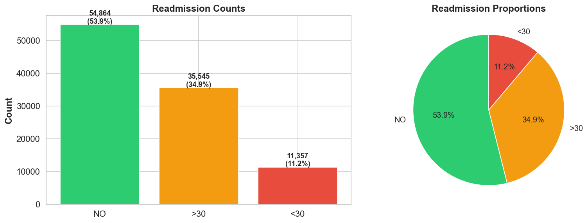
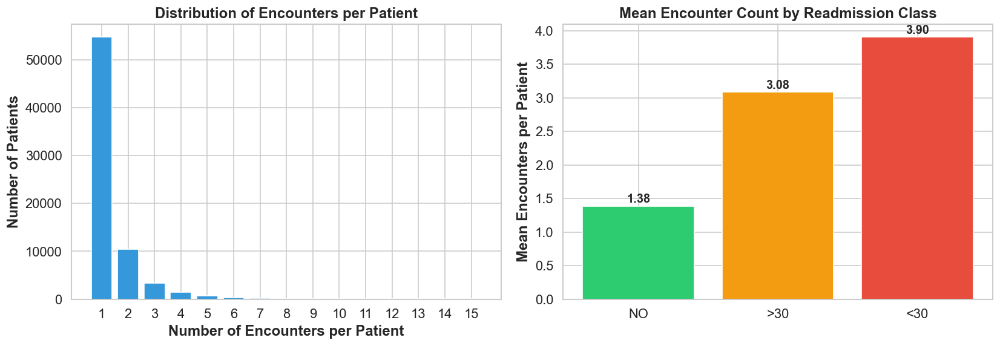
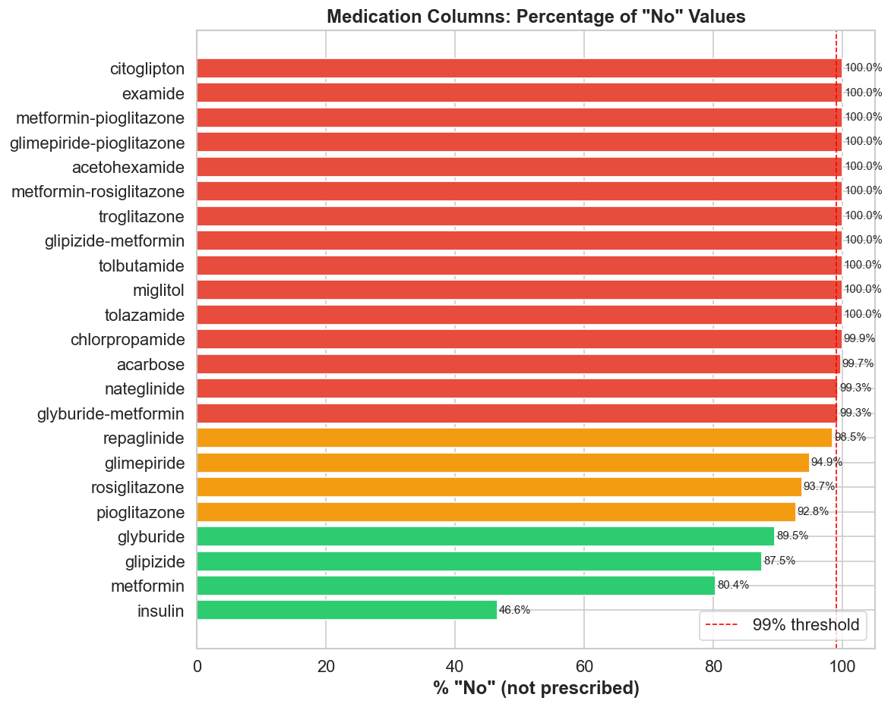
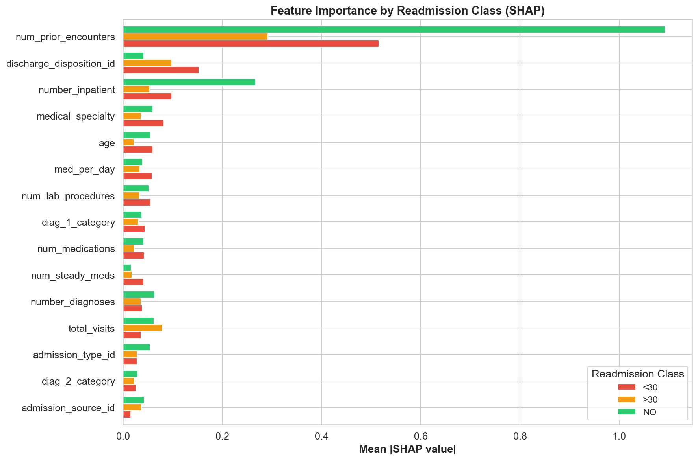
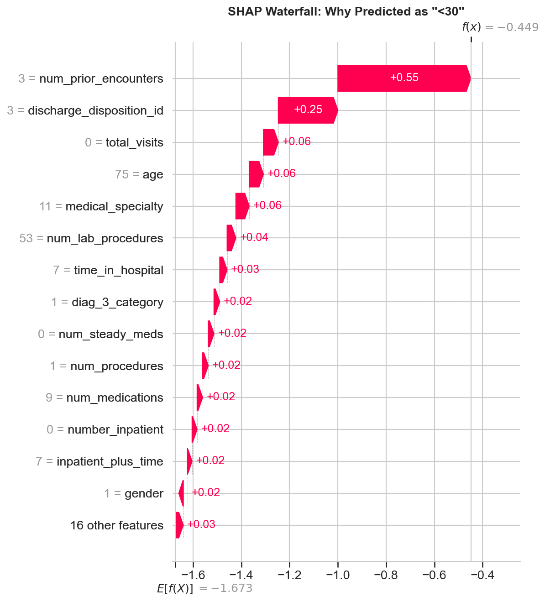

# Diabetes Hospital Readmission Prediction

Predicting hospital readmission outcomes for diabetic patients using AutoGluon, trained on the UCI Diabetes 130-US Hospitals dataset (101,766 encounters, 1999-2008).

**Final Model Performance (Test Set):**

| Metric | Score |
|--------|-------|
| F1 Macro | **0.586** |
| Accuracy | **0.699** |
| AUC-ROC | **0.781** |

---

## 1. Project Overview

This project builds a **3-class classification model** to predict whether a diabetic patient will be:
- **NO** -- not readmitted
- **>30** -- readmitted after 30 days
- **<30** -- readmitted within 30 days

### Approach

1. **Literature-driven preprocessing** -- published papers on this dataset were reviewed to inform feature engineering decisions
2. **Domain-aware feature engineering** -- ICD-9 diagnosis grouping, patient encounter history, medication aggregation, and clinical test retention
3. **AutoGluon TabularPredictor** -- automated model selection, hyperparameter tuning, and multi-level stacking ensemble (30 models evaluated)
4. **SHAP explainability** -- global and local model explanations to validate clinical relevance
5. **Streamlit web app** -- interactive dashboard with live predictions, SHAP visualisations, and GPT-4o narrative generation

### Key Innovation

The strongest predictor discovered through EDA was **patient encounter frequency** -- patients readmitted within 30 days had an average of 3.9 prior encounters vs 1.4 for non-readmitted patients. This feature alone drove the largest single performance improvement.

---

## 2. Environment Setup

### Prerequisites
- Python 3.12
- [uv](https://docs.astral.sh/uv/) package manager
- macOS: `brew install libomp` (required for LightGBM)

### Setup Steps

```bash
# 1. Clone the repository
git clone <repository-url>
cd NVIDIA_Omniverse_AI_Engineering_Assignment

# 2. Create virtual environment with uv (Python 3.12 required)
uv venv --python 3.12

# 3. Activate the environment
source .venv/bin/activate      # Linux / macOS
.venv\Scripts\activate         # Windows

# 4. Install all dependencies
uv pip install -r requirements.txt

# 5. macOS only: install OpenMP for LightGBM
brew install libomp

# 6. Download trained model artefacts (6.1 GB — too large for GitHub)
#    Download ag_models.zip from the link below and extract into the project root:
unzip ag_models.zip
```

### Model Download

The trained AutoGluon model (`ag_models/`, 6.1 GB) exceeds GitHub's file size limit.
Download and extract it before running predictions:

| File | Size | Link |
|------|------|------|
| `ag_models.zip` | ~6.1 GB | **[Google Drive](https://drive.google.com/file/d/1QSnrynKlKmQre7vrlkc7rkK--x4bzbob/view?usp=sharing)** |

After downloading, extract into the project root so the directory structure is `ag_models/models/...`.

---

## 3. Repository Structure

```
NVIDIA_Omniverse_AI_Engineering_Assignment/
├── data_diabetes_hospital_readmission_1999-2008/
│   ├── diabetic_data.csv               # Original dataset (101,766 x 50)
│   └── IDS_mapping.csv                 # ID-to-description mapping tables
│
├── data_preparation.py                 # Data preprocessing + feature engineering
├── train_model.py                      # AutoGluon model training + evaluation
├── predict.py                          # Inference script (grader usage)
├── app.py                              # Streamlit web app (live predictions + SHAP + AI narrative)
│
├── eda.ipynb                           # Exploratory Data Analysis (79 cells)
│                                       #   Sections 1-16: Core EDA on raw data
│                                       #   Sections 17-19: Advanced EDA (statistical tests, PCA/t-SNE, Plotly)
│                                       #   Section 20: EDA-to-preprocessing summary
│
├── model_explainability.ipynb          # SHAP analysis + model explainability
│                                       #   Global + local explanations
│                                       #   Feature importance + dependence plots
│
├── ag_models/                          # Trained AutoGluon model artefacts (download link above)
├── metrics/                            # Evaluation metrics (JSON + CSV)
│   ├── evaluation_metrics.json
│   └── classification_report.csv
├── charts/                             # All visualisations (26 PNG)
│
├── train_data.csv                      # Training set (75,498 x 31)
├── test_data.csv                       # Hold-out test set (18,875 x 31)
├── unseen_data.csv                     # 5% stratified sample for grader evaluation (4,967 x 31)
├── leaderboard.csv                     # AutoGluon model leaderboard (30 models)
│
├── requirements.txt                    # Pinned dependencies (uv pip freeze)
└── README.md                           # This file
```

---

## 4. Data Preparation Pipeline

The preprocessing pipeline (`data_preparation.py`) transforms the raw dataset through a series of steps, each grounded in EDA findings and published literature.

### Pipeline Flow

```
Original Data (101,766 x 50)
  |-- ID mapping (admission_type, discharge_disposition, admission_source)
  |-- Remove deceased/hospice patients (~2,500 rows) [Strack 2014, Garcia-Mosquera 2025]
  |-- Clean: '?' -> NaN, remove invalid gender (3 rows), deduplicate
  |-- Feature Engineering (see below)
  |-- Stratified 5% unseen sample -> unseen_data.csv (4,967 rows)
  |-- 80/20 stratified split -> train_data.csv / test_data.csv
Final Data (94,373 x 31)
```

### Feature Engineering (with EDA/Literature Justification)

| Feature | What | Why (EDA Finding) | Literature |
|---------|------|-------------------|------------|
| `num_prior_encounters` | Patient visit count from `patient_nbr` | Mean encounters: `<30`=3.9, `>30`=3.1, NO=1.4 (Section 9) | Garcia-Mosquera 2025: #1 predictor |
| `diag_1/2/3_category` | ICD-9 codes grouped into 9 categories | 700+ unique codes create extreme cardinality (Section 7) | Strack 2014: standard grouping |
| `num_active_meds`, `num_med_changes`, `num_steady_meds` | 23 medication columns aggregated | 80-99%+ "No" in most columns (Section 8) | Garcia-Mosquera 2025: insulin most important |
| `A1Cresult`, `max_glu_serum` | Kept as categorical with "Not Tested" | "Test vs no-test" carries clinical signal (Section 3) | Strack 2014: HbA1c study |
| `age` (numeric) | "[70-80)" -> 75 midpoint | String ranges prevent tree splitting (Section 6) | Common practice |
| `medical_specialty` | 73 -> 12 groups | High cardinality reduction (Section 6) | - |
| `total_visits` | outpatient + emergency + inpatient | Composite utilization metric (Section 10) | Emi-Johnson 2025 |
| `med_per_day` | medications / time_in_hospital | Medication intensity proxy | - |
| Deceased/hospice removal | Patients who cannot be readmitted | All labeled "NO" -- creates spurious pattern (Section 15) | All reviewed papers |

---

## 5. Running the Training Script

```bash
# Step 1: Prepare data (reads raw CSV, applies full pipeline)
python data_preparation.py

# Step 2: Train AutoGluon model (~1 hour)
python train_model.py
```

### Training Configuration

| Setting | Value |
|---------|-------|
| Framework | AutoGluon TabularPredictor 1.5.0 |
| Preset | `best_quality` (multi-level stacking + bagging) |
| Eval Metric | `f1_macro` (accounts for class imbalance) |
| Time Limit | 3,600 seconds (1 hour) |
| Sample Weight | Inverse class frequency (`<30`: 2.93x, `>30`: 0.93x, NO: 0.63x) |

### Output

| File | Description |
|------|-------------|
| `ag_models/` | All trained model artefacts (loadable without retraining) |
| `leaderboard.csv` | 30 models ranked by performance with full metrics |
| `metrics/evaluation_metrics.json` | Best model evaluation (accuracy, F1, per-class) |
| `metrics/classification_report.csv` | Per-class precision, recall, F1 |
| `charts/confusion_matrix.png` | Confusion matrix (counts + normalized) |

---

## 6. Running Inferencing

Two options are available for graders to run predictions:

### Option 1: Streamlit Web App (Recommended)

```bash
streamlit run app.py
```

Navigate to **"Live Predictions"** in the sidebar, then upload `unseen_data.csv` (or click "Use sample data") to instantly view predictions with confidence scores, SHAP explanations, and AI narrative reports. No command-line experience required.

### Option 2: Command Line

```bash
# Single command -- uses unseen_data.csv by default
python predict.py
```

This produces `predictions.csv` containing:
- Original data columns
- `predicted_readmitted` -- predicted class
- `prob_<30`, `prob_>30`, `prob_NO` -- class probabilities

```bash
# Custom input/output
python predict.py --input your_data.csv --output your_results.csv
```

### Raw Data Support

Both options **automatically detect** whether input data is raw (original 50-column format) or preprocessed. If raw data is provided, the full feature engineering pipeline is applied before prediction. No code modification required.

---

## 7. Model Performance

### Best Model: WeightedEnsemble_L3

| Metric | Score |
|--------|-------|
| Accuracy | 0.699 |
| F1 Macro | 0.586 |
| AUC-ROC | 0.781 |

### Per-Class Performance (Test Set: 18,875 samples)

| Class | Precision | Recall | F1 Score | Support |
|-------|-----------|--------|----------|---------|
| `<30` (within 30 days) | 0.354 | 0.303 | 0.327 | 2,150 |
| `>30` (after 30 days) | 0.646 | 0.572 | 0.607 | 6,745 |
| `NO` (not readmitted) | 0.786 | 0.871 | 0.826 | 9,980 |

### Leaderboard (Top 5)

| Rank | Model | F1 Macro | Accuracy | AUC-ROC |
|------|-------|----------|----------|---------|
| 1 | WeightedEnsemble_L3 | 0.586 | 0.699 | 0.781 |
| 2 | WeightedEnsemble_L2 | 0.586 | 0.698 | 0.781 |
| 3 | LightGBMLarge_BAG_L2 | 0.581 | 0.679 | 0.781 |
| 4 | LightGBMLarge_BAG_L1 | 0.576 | 0.678 | 0.778 |
| 5 | LightGBM_BAG_L2 | 0.572 | 0.665 | 0.782 |

### Benchmark Comparison

Compared against Garcia-Mosquera et al. (2025), who used a Transformer on the same dataset with 3-class classification:

| Model | Accuracy | AUC-ROC | Hardware |
|-------|----------|---------|----------|
| Garcia-Mosquera Transformer | 46.47% | 0.619 | GPU (RTX 3060) |
| Garcia-Mosquera SVM | 61.24% | 0.613 | CPU |
| **This Project (AutoGluon)** | **69.94%** | **0.781** | **CPU only** |

> **Note:** All models use the same UCI Diabetes 130-US Hospitals dataset, but differ in preprocessing pipelines, feature engineering, and train/test splits. This comparison provides directional context rather than a strict apples-to-apples benchmark.

---

## 8. EDA Highlights

The EDA notebook (`eda.ipynb`) contains 79 cells analyzing the raw dataset. Key findings that shaped the preprocessing pipeline:

### Class Imbalance (4.8:1)



The minority class (`<30`) represents only 11.2% of encounters. Addressed with inverse-frequency sample weighting and F1 Macro optimization.

### Patient Encounter Frequency -- Strongest Predictor



Patients readmitted within 30 days averaged **3.9 prior encounters** vs 1.4 for non-readmitted. This EDA finding led to the creation of `num_prior_encounters`, which SHAP analysis later confirmed as the #1 predictor.

### Medication Columns -- Near-Zero Variance



15 of 23 medication columns were 99%+ "No", with the remaining 8 ranging from 80-99%. Aggregated into 3 summary features to reduce noise while preserving dosage change information.

### Advanced EDA

- **PCA / t-SNE**: Classes overlap significantly in feature space, confirming this is an inherently difficult problem
- **Kruskal-Wallis Tests**: All numerical features differ significantly (p < 0.05) across readmission groups
- **Plotly Interactive Charts**: Sunburst (diagnosis-readmission drill-down), parallel coordinates, interactive box plots

---

## 9. Model Explainability

The `model_explainability.ipynb` notebook provides SHAP-based explanations for model predictions.

### Global Feature Importance



`num_prior_encounters` dominates across all classes, followed by `number_inpatient` and `discharge_disposition_id`.

### Local Explanation Example



Individual patient predictions are fully decomposed into feature contributions. This waterfall plot shows a patient predicted as `<30` (readmitted within 30 days) -- the primary driver is `num_prior_encounters` contributing +0.55 to the prediction.

### LLM Narrative Integration

The Streamlit app (`app.py`) integrates GPT-4o to generate plain-English narrative reports explaining prediction results, SHAP analysis, and clinical implications.

---

## 10. Dependencies

| Package | Version | Purpose |
|---------|---------|---------|
| Python | 3.12 | Runtime |
| autogluon-tabular | 1.5.0 | AutoML framework |
| pandas | 2.3.3 | Data manipulation |
| scikit-learn | 1.7.2 | Splitting, metrics |
| lightgbm | 4.6.0 | Gradient boosting (AutoGluon internal) |
| xgboost | 3.1.3 | Gradient boosting (AutoGluon internal) |
| catboost | 1.2.10 | Gradient boosting (AutoGluon internal) |
| shap | 0.51.0 | Model explainability |
| matplotlib / seaborn | 3.10.8 / 0.13.2 | Static visualisation |
| plotly | 6.6.0 | Interactive visualisation |
| scipy | 1.16.3 | Statistical testing |
| streamlit | 1.55.0 | Web application |
| openai | 2.30.0 | LLM narrative generation |
| python-dotenv | 1.2.2 | Environment variable management |

Full pinned dependency list: `requirements.txt`

---

## References

1. Strack B, DeShazo JP, Gennings C, et al. "Impact of HbA1c Measurement on Hospital Readmission Rates: Analysis of 70,000 Clinical Database Patient Records." *BioMed Research International*, 2014. DOI: [10.1155/2014/781670](https://doi.org/10.1155/2014/781670)

2. Garcia-Mosquera J, Villa-Monedero M, Gil-Martin M, San-Segundo R. "Transformer-Based Prediction of Hospital Readmissions for Diabetes Patients." *Electronics*, 2025, 14(1), 174. DOI: [10.3390/electronics14010174](https://doi.org/10.3390/electronics14010174)

3. Emi-Johnson OG, et al. "Predicting 30-Day Hospital Readmission in Patients With Diabetes Using Machine Learning on Electronic Health Record Data." *Cureus*, 2025. DOI: [10.7759/cureus.82437](https://doi.org/10.7759/cureus.82437)

4. Liu et al. "Comparison of Machine Learning Models for Predicting 30-Day Readmission Rates for Patients with Diabetes." *Journal of Medical Artificial Intelligence*, 2024. DOI: [10.21037/jmai-24-70](https://doi.org/10.21037/jmai-24-70)
